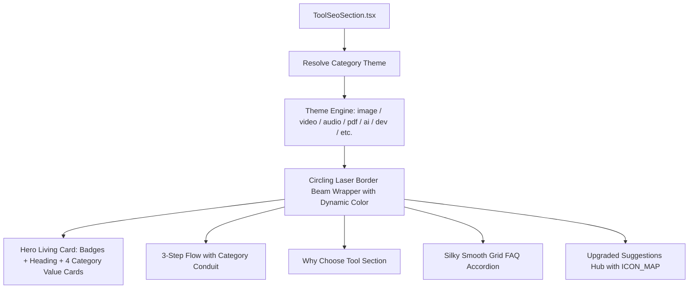

# 🚀 Exismic Studio — Universal Living Guide & Overview Roadmap

> **Sprint Objective**: Systematically roll out the approved **Obsidian Cyber Living Guide & Overview Section** across all tools on Exismic.
> **Design Precedent**: Approved on Background Remover (`/tools/image/eraser`).
> **Core Pillars**:
> 1. **Circling Laser Border Beam**: 360° rotating conic gradient laser gliding continuously around the entire card perimeter.
> 2. **Category Color Engine**: Every tool dynamically adopts the signature color palette of its category (Cyan for Image, Violet for Video, Pink for Audio, Red for PDF, Amber for AI, Emerald for Productivity, Lime for Developer, etc.).
> 3. **Elimination of Tech Jargon**: 100% human-friendly, creator-focused copy with zero developer buzzwords or fake specs.
> 4. **Strict Mobile Compatibility**: 1-column responsive layout, 44px+ touch targets, hidden horizontal conduits on mobile, and zero horizontal overflow.
> 5. **Silky Smooth Accordion Animations**: CSS Grid Rows (`0fr` → `1fr`) 60fps liquid disclosure.
> 6. **Upgraded Suggestions UI**: Real 3D tool icons (`ICON_MAP`), specular top rims, category ambient spotlights, and `Open Tool` actions.

---

## 🎨 1. Dynamic Category Theme Matrix

Each category possesses a distinct visual signature, ensuring tools feel cohesive yet deeply specialized:

| Category ID | Category Name | Signature Color | Primary Hex | Tailwind Text | Border & Glow Accent | Conic Laser Beam Gradient |
| :--- | :--- | :--- | :--- | :--- | :--- | :--- |
| `image` | **Image Tools** | Electric Cyan | `#06b6d4` | `text-cyan-300` | `border-cyan-400/30`, `rgba(6,182,212,0.2)` | `from 0deg at 50% 50%, transparent 270deg, #06b6d4 330deg, #22d3ee 350deg, #a5f3fc 358deg, transparent 360deg` |
| `video` | **Video Tools** | Quantum Violet | `#8b5cf6` | `text-violet-300` | `border-violet-400/30`, `rgba(139,92,246,0.2)` | `from 0deg at 50% 50%, transparent 270deg, #8b5cf6 330deg, #a78bfa 350deg, #ddd6fe 358deg, transparent 360deg` |
| `audio` | **Audio & Music** | Neon Pink | `#ec4899` | `text-pink-300` | `border-pink-400/30`, `rgba(236,72,153,0.2)` | `from 0deg at 50% 50%, transparent 270deg, #ec4899 330deg, #f472b6 350deg, #fbcfe8 358deg, transparent 360deg` |
| `pdf` | **PDF Tools** | Crimson Red | `#ef4444` | `text-red-300` | `border-red-400/30`, `rgba(239,68,68,0.2)` | `from 0deg at 50% 50%, transparent 270deg, #ef4444 330deg, #f87171 350deg, #fecaca 358deg, transparent 360deg` |
| `ai` | **AI Magic** | Solaris Amber | `#f59e0b` | `text-amber-300` | `border-amber-400/30`, `rgba(245,158,11,0.2)` | `from 0deg at 50% 50%, transparent 270deg, #f59e0b 330deg, #fbbf24 350deg, #fde68a 358deg, transparent 360deg` |
| `productivity` | **Productivity** | Matrix Emerald | `#10b981` | `text-emerald-300` | `border-emerald-400/30`, `rgba(16,185,129,0.2)` | `from 0deg at 50% 50%, transparent 270deg, #10b981 330deg, #34d399 350deg, #a7f3d0 358deg, transparent 360deg` |
| `developer` | **Developer Tools** | Cyber Lime | `#84cc16` | `text-lime-300` | `border-lime-400/30`, `rgba(132,204,22,0.2)` | `from 0deg at 50% 50%, transparent 270deg, #84cc16 330deg, #a3e635 350deg, #d9f99d 358deg, transparent 360deg` |
| `creator` | **Creator & Social** | Synthwave Rose | `#f43f5e` | `text-rose-300` | `border-rose-400/30`, `rgba(244,63,94,0.2)` | `from 0deg at 50% 50%, transparent 270deg, #f43f5e 330deg, #fb7185 350deg, #fecdd3 358deg, transparent 360deg` |
| `student` | **Student & Academic** | Royal Indigo | `#6366f1` | `text-indigo-300` | `border-indigo-400/30`, `rgba(99,102,241,0.2)` | `from 0deg at 50% 50%, transparent 270deg, #6366f1 330deg, #818cf8 350deg, #c7d2fe 358deg, transparent 360deg` |
| `business` | **Business & Finance** | Flare Orange | `#f97316` | `text-orange-300` | `border-orange-400/30`, `rgba(249,115,22,0.2)` | `from 0deg at 50% 50%, transparent 270deg, #f97316 330deg, #fb923c 350deg, #fed7aa 358deg, transparent 360deg` |
| `seo` | **SEO & Growth** | Azure Sky | `#0284c7` | `text-sky-300` | `border-sky-400/30`, `rgba(2,132,199,0.2)` | `from 0deg at 50% 50%, transparent 270deg, #0284c7 330deg, #38bdf8 350deg, #bae6fd 358deg, transparent 360deg` |

---

## 📱 2. Mobile UI Compatibility & Responsive Engineering

To guarantee a flawless experience across all smartphones (iPhone SE, iPhone 15/16 Pro, Samsung Galaxy, Pixel) and tablets:

1. **Tight Vertical Spacing**:
   - Container padding: `p-5 sm:p-7 lg:p-8`.
   - Tight header grouping: Badges sit immediately above the title (`space-y-2.5`), eliminating huge awkward vertical voids.
2. **Fluid Responsive Typography**:
   - Main Heading: `text-2xl sm:text-3xl lg:text-4xl font-black`.
   - Body Copy: `text-sm sm:text-base leading-relaxed`.
3. **Adaptive Column Grids**:
   - Value Cards: `grid-cols-1 sm:grid-cols-2 lg:grid-cols-4 gap-3.5`.
   - 3-Step Cards: `grid-cols-1 md:grid-cols-3 gap-4 sm:gap-5`.
   - Suggestions Grid: `grid-cols-1 sm:grid-cols-2 lg:grid-cols-4 gap-4`.
4. **Touch-Friendly Hit Targets**:
   - All accordion headers have a minimum tap target height of $\ge 52$px with `select-none`.
   - Action links and badges have comfortable padding (`px-3 py-1.5`).
5. **Connecting Laser Conduit Handling**:
   - The horizontal laser conduit beam is displayed on desktop (`hidden md:block absolute top-12 left-[18%] right-[18%]`) and safely hidden on mobile to prevent layout collision with vertical stacking.
6. **Zero Horizontal Overflow**:
   - All rotating conic gradient wrappers utilize `overflow-hidden rounded-3xl` so rotating elements never cause horizontal document scrolling on iOS Safari or Android Chrome.

---

## 💎 3. Universal Living Overview Component Specs

Every tool will automatically receive the 5 core sections rendered in Obsidian Cyber aesthetics:

### Section 1: Hero Living Container
- **Outer Rotating Border Beam**: Conic gradient spinning at `animate-[spin_5s_linear_infinite]` around all 4 edges and 4 rounded corners.
- **Inner Obsidian Glass**: `#070914/95` with `backdrop-blur-2xl`.
- **Top Badges**: Category-themed pill with live pulsing radar beacon (`● Guide & Overview`) and feature badge (`100% Free • No Sign-Up`).
- **Interactive Mouse Spotlight**: Radial spotlight tracking the cursor across the card.
- **4 Living Value Cards**:
  - Top specular rim highlight line (`h-[1px] bg-gradient-to-r`).
  - Ambient radial spotlight on hover matching category color.
  - 3D squircle icon container with hover scale (`scale-110`) and micro-tilt (`-rotate-3`).
  - Live pulsing radar beacon badge.
  - Hover lift `-translate-y-1.5` with category glow shadow.

### Section 2: 3-Step Workflow ("How to Use in 3 Simple Steps")
- Category-themed 3D numeric capsules (`01`, `02`, `03`) with halo rings.
- Connecting laser conduit line across desktop with traveling shimmer light.
- Clear, jargon-free instructions covering Upload/Input, Configuration/Auto-Processing, and Download/Export.

### Section 3: Why Choose Section ("Why Choose Exismic {ToolName}?")
- 4-item high-contrast grid with glowing check icons.
- Highlights practical benefits: privacy, zero watermarks, speed, high resolution.

### Section 4: Frequently Asked Questions (FAQ)
- **Silky Smooth Accordion**: CSS Grid Rows transition (`grid-rows-[0fr]` → `grid-rows-[1fr]`, `opacity-0` → `opacity-100`, `duration-300 ease-in-out`).
- Category-accented `[Q]` badges and 180° rotating chevrons.
- First item open by default for immediate visual feedback.
- Schema.org `FAQPage` JSON-LD automatically injected for Googlebot.

### Section 5: Suggestions Hub ("Explore More {CategoryName}")
- Category-themed header with companion tool descriptor and styled `View All Tools` button.
- 4 luxury Obsidian cards with authentic 3D tool icons from `ICON_MAP`.
- Top specular rims, ambient hover spotlights, and `Open Tool →` actions.

---

## 🚫 4. Strict Elimination of Technical Jargon

### Banned Buzzwords vs. Approved Creator Language

| Banned Jargon ❌ | Approved Creator Language ✅ |
| :--- | :--- |
| "Client-side WebAssembly (WASM) + WebGPU pipeline" | "Fast in-browser processing directly on your device" |
| "8-Bit Alpha (256 levels of smooth transparency)" | "Crisp, smooth cutouts with clean transparent edges" |
| "Sub-pixel neural edge-matting engine" | "Clean edges around hair, clothing, and small details" |
| "Hardware accelerated with zero latency queues" | "Removes backgrounds automatically in under 3 seconds" |
| "Encrypted ephemeral sandbox execution" | "100% private. Your photos never leave your device" |
| "Lossless visual fidelity and AST parsing" | "High-resolution quality with sharp details and true colors" |
| "ISO 32000 standard compliant PDF vector tree" | "Keeps all fonts, layouts, and links sharp and readable" |
| "Frequency spectral bleed & stem de-multiplexing" | "Separates vocals and music cleanly without distortion" |

---

## 📦 5. Complete Category Tool Inventory (All 104 Tools)

Each category is powered by its signature theme, featuring tailored, creator-friendly value props, a clear 3-step workflow, and realistic FAQs:

### 1. Image Tools (`image`) — Accent: Electric Cyan (`#06b6d4`)
* **Theme Signature**: Electric Cyan border beam, cyan badges, `rgba(6,182,212,0.2)` hover spotlights.
* **Core Value Props**: 
  1. *Sharp Edge Clarity*: Crisp edges around fine hair, clothing, and small product details.
  2. *Standard Format Support*: Works seamlessly with PNG, JPG, WebP, and SVG files.
  3. *In-Browser Processing*: Instant results right on your device with zero upload delays.
  4. *Watermark-Free Downloads*: High-resolution exports ready for commercial or personal use.
* **3-Step Workflow**:
  - `Step 01`: Drop your image into the workspace canvas.
  - `Step 02`: Adjust options or let our smart tools auto-process your picture.
  - `Step 03`: Download your crisp, transparent or optimized image in 1 click.
* **All 11 Tools in Category**:
  1. **Background Remover** (`/tools/image/eraser`) — *COMPLETED & APPROVED*
  2. **Bulk Compressor** (`/tools/image/compressor`)
  3. **Resizer & Cropper** (`/tools/image/resizer`)
  4. **Format Converter** (`/tools/image/converter`)
  5. **Watermark Remover** (`/tools/image/watermark-remover`)
  6. **Image Vectorizer** (`/tools/image/vectorizer`)
  7. **Collage Maker** (`/tools/image/collage`)
  8. **AI Minecraft Skin Maker** (`/tools/image/minecraft-skin`)
  9. **YouTube Thumbnail Maker** (`/tools/youtube/thumbnail`)
  10. **Meme Generator** (`/tools/meme-generator`)
  11. **Private Photo & Screen Blur Studio** (`/tools/image/redact-blur`)

---

### 2. Video Tools (`video`) — Accent: Quantum Violet (`#8b5cf6`)
* **Theme Signature**: Quantum Violet border beam, violet badges, `rgba(139,92,246,0.2)` hover spotlights.
* **Core Value Props**: 
  1. *Smooth High-Def Playback*: Exports silky 1080p and 4K clips without stutter or frame drops.
  2. *Universal Video Formats*: Full compatibility with MP4, MOV, WebM, and MKV files.
  3. *Fast In-Browser Cuts*: Trim, split, and edit video directly on your device with zero lag.
  4. *Zero Watermarks*: Clean, broadcast-ready videos for YouTube, TikTok, Reels, and ads.
* **3-Step Workflow**:
  - `Step 01`: Select or drag your video file into the studio timeline.
  - `Step 02`: Fine-tune your start/end points, captions, or resolution preset.
  - `Step 03`: Click export and download your smooth, watermark-free video instantly.
* **All 6 Tools in Category**:
  1. **Video Trimmer** (`/tools/video/trimmer`)
  2. **Video Compressor** (`/tools/video/compressor`)
  3. **Subtitle Generator** (`/tools/video/subtitles`)
  4. **Video Enhancer** (`/tools/video/enhancer`)
  5. **Video to GIF** (`/tools/video/to-gif`)
  6. **Video Merger** (`/tools/video/merger`)

---

### 3. Audio & Music (`audio`) — Accent: Neon Pink (`#ec4899`)
* **Theme Signature**: Neon Pink border beam, pink badges, `rgba(236,72,153,0.2)` hover spotlights.
* **Core Value Props**: 
  1. *Studio Sound Quality*: Clean audio preservation with deep bass, warm mids, and crisp highs.
  2. *Clean Vocal Isolation*: Separate singing voices from background music without harsh distortion.
  3. *Universal Audio Support*: Handles MP3, WAV, FLAC, AAC, and M4A audio files seamlessly.
  4. *Live Waveform Monitor*: Real-time interactive frequency playback to listen before exporting.
* **3-Step Workflow**:
  - `Step 01`: Drop your audio track or voice recording into the player.
  - `Step 02`: Choose your vocal mode, reverb fader, or noise reduction preset.
  - `Step 03`: Listen to the live preview and download your clean WAV or MP3 stem.
* **All 10 Tools in Category**:
  1. **Vocal Remover** (`/tools/audio/vocal-remover`)
  2. **Full Stem Splitter** (`/tools/audio/stem-splitter`)
  3. **Noise Remover** (`/tools/audio/noise-remover`)
  4. **Text to Speech** (`/tools/audio/tts`)
  5. **Speech to Text** (`/tools/audio/stt`)
  6. **Voice Changer** (`/tools/audio/voice-changer`)
  7. **AI Sound Effects** (`/tools/audio/sfx`)
  8. **Cinematic Ambient Mixer** (`/tools/audio/ambient-mixer`)
  9. **Slowed + Reverb & Sped-Up Music Studio** (`/tools/audio/slowed-reverb`)
  10. **Audio Waveform Video Maker (Podcast Reels)** (`/tools/audio/audiogram`)

---

### 4. PDF Tools (`pdf`) — Accent: Crimson Red (`#ef4444`)
* **Theme Signature**: Crimson Red border beam, red badges, `rgba(239,68,68,0.2)` hover spotlights.
* **Core Value Props**: 
  1. *Keeps Layouts Intact*: Preserves original typography, high-res graphics, and hyperlinks.
  2. *100% Private & Local*: Your confidential documents stay safely on your computer.
  3. *Small File Sizes*: Shrinks PDF weights while keeping text crystal-clear and readable.
  4. *Simple Page Reordering*: Effortlessly merge, split, and rotate pages with visual thumbnails.
* **3-Step Workflow**:
  - `Step 01`: Upload your PDF files or drag them straight onto the page grid.
  - `Step 02`: Reorder pages, select page ranges, or choose your target file size.
  - `Step 03`: Click process and download your merged, compressed, or converted document.
* **All 7 Tools in Category**:
  1. **PDF Merger** (`/tools/pdf/merger`)
  2. **PDF Splitter** (`/tools/pdf/splitter`)
  3. **PDF Compressor** (`/tools/pdf/compressor`)
  4. **PDF to Image** (`/tools/pdf/to-img`)
  5. **Image to PDF** (`/tools/pdf/img-to-pdf`)
  6. **PDF to Word** (`/tools/pdf/to-word`)
  7. **OCR Extractor** (`/tools/pdf/ocr`)

---

### 5. AI Magic (`ai`) — Accent: Solaris Amber (`#f59e0b`)
* **Theme Signature**: Solaris Amber border beam, amber badges, `rgba(245,158,11,0.2)` hover spotlights.
* **Core Value Props**: 
  1. *Creative Brainstorming*: Instant inspiration, sharp copy, and creative visual concepts.
  2. *Natural Human Flow*: Engaging, well-structured writing that sounds authentic and relatable.
  3. *Effortless Customization*: Tune the tone, length, and style in 1 click to match your voice.
  4. *Instant Results*: Fast generation with zero waiting queues or complicated settings.
* **3-Step Workflow**:
  - `Step 01`: Enter your idea, topic, or creative prompt in the input box.
  - `Step 02`: Select your desired style, format, or creative tone.
  - `Step 03`: Copy your generated content or export your new visual asset in seconds.
* **All 15 Tools in Category**:
  1. **AI Writer** (`/tools/ai/writer`)
  2. **AI Image Generator** (`/tools/ai/image-generator`)
  3. **AI Chat** (`/tools/ai/chat`)
  4. **Exismic Support Agent** (`/tools/ai/support`)
  5. **AI Logo Generator** (`/tools/ai/logo`)
  6. **AI Landing Page** (`/tools/ai/landing-page`)
  7. **YouTube AI Summarizer** (`/tools/ai/youtube-summarizer`)
  8. **Artistic AI QR Code** (`/tools/ai/artistic-qr`)
  9. **Text-to-3D Generator** (`/tools/ai/text-to-3d`)
  10. **Social Caption Gen** (`/tools/ai/social-caption`)
  11. **AI Humanizer** (`/tools/ai/humanizer`)
  12. **AI Content Detector** (`/tools/ai/detector`)
  13. **Grammar & Style Checker** (`/tools/ai/grammar`)
  14. **Email Reply Generator** (`/tools/ai/email-reply`)
  15. **AI Mega-Prompt Builder** (`/tools/ai/prompt-builder`)

---

### 6. Developer Tools (`developer`) — Accent: Cyber Lime (`#84cc16`)
* **Theme Signature**: Cyber Lime border beam, lime badges, `rgba(132,204,22,0.2)` hover spotlights.
* **Core Value Props**: 
  1. *Runs Entirely In Browser*: Instant formatting and parsing with zero network round-trips.
  2. *Clean Syntax Highlighting*: Beautiful code formatting with color tags and line numbering.
  3. *1-Click Clipboard Actions*: Fast copy buttons for JSON, regex, tokens, and code snippets.
  4. *Zero Data Storage*: Sensitive tokens, keys, and schemas never leave your browser window.
* **3-Step Workflow**:
  - `Step 01`: Paste your raw code, JSON payload, or text into the editor.
  - `Step 02`: Choose your formatting options, indentation, or comparison mode.
  - `Step 03`: Inspect the highlighted output and copy or download your clean code.
* **All 15 Tools in Category**:
  1. **Password Generator** (`/tools/productivity/passgen`)
  2. **JSON Formatter** (`/tools/productivity/json`)
  3. **Base64 Encoder / Decoder** (`/tools/developer/base64`)
  4. **UUID / GUID Generator** (`/tools/developer/uuid`)
  5. **Hash Generator (MD5 / SHA-256)** (`/tools/developer/hash`)
  6. **Regex Tester & Debugger** (`/tools/developer/regex`)
  7. **Lorem Ipsum Generator** (`/tools/developer/lorem`)
  8. **JSON to TypeScript & Zod Converter** (`/tools/developer/json-to-ts`)
  9. **SVG Optimizer & File Cleaner (SVGO)** (`/tools/developer/svg-optimizer`)
  10. **Cron Expression Generator & Explainer** (`/tools/developer/cron`)
  11. **Visual SQL Query Builder & AI Assistant** (`/tools/developer/sql-builder`)
  12. **Aesthetic Code Snippet Studio** (`/tools/developer/code-snippet`)
  13. **Favicon & App Icon Studio** (`/tools/developer/favicon-studio`)
  14. **CSS Mesh Gradient & Glass Studio** (`/tools/developer/mesh-gradient`)
  15. **Text & Code Comparison Studio (Diff Checker)** (`/tools/developer/diff-checker`)

---

### 7. Creator & Social (`creator`) — Accent: Synthwave Rose (`#f43f5e`)
* **Theme Signature**: Synthwave Rose border beam, rose badges, `rgba(244,63,94,0.2)` hover spotlights.
* **Core Value Props**: 
  1. *Attention-Grabbing Visuals*: Designed to maximize click-throughs, likes, and shares.
  2. *Pixel-Perfect Platform Sizes*: Built for Instagram, Twitter/X, LinkedIn, TikTok, and YouTube.
  3. *High-Resolution Exports*: Crisp PNG and MP4 downloads ready to post immediately.
  4. *Fast Studio Presets*: Jumpstart your content with curated templates for any niche.
* **3-Step Workflow**:
  - `Step 01`: Type your copy or choose a curated template from the library.
  - `Step 02`: Customize colors, avatar, typography, and layout accents.
  - `Step 03`: Export your clean graphic or teleprompter script and share with your audience.
* **All 7 Tools in Category**:
  1. **AI Video Hook & Script Generator** (`/tools/creator/video-hooks`)
  2. **LinkedIn Post Formatter & Hook Creator** (`/tools/creator/linkedin-formatter`)
  3. **YouTube Thumbnail CTR & Contrast Analyzer** (`/tools/creator/thumbnail-analyzer`)
  4. **AI Social Carousel Generator** (`/tools/creator/carousel-maker`)
  5. **3D Device & App Mockup Studio** (`/tools/creator/mockup-studio`) *(Protected/Direct-link)*
  6. **Fake Social Post & Tweet Studio** (`/tools/creator/post-mockup`)
  7. **Live Studio Teleprompter** (`/tools/creator/teleprompter`)

---

### 8. Student & Academic (`student`) — Accent: Royal Indigo (`#6366f1`)
* **Theme Signature**: Royal Indigo border beam, indigo badges, `rgba(99,102,241,0.2)` hover spotlights.
* **Core Value Props**: 
  1. *Clear Learning Summaries*: Condenses dense textbooks and lecture notes into bite-sized key takeaways.
  2. *Accurate Step-by-Step Solutions*: Breaks down complex math, equations, and science concepts.
  3. *Standard Citation Formats*: Generate APA, MLA, Chicago, and Harvard references effortlessly.
  4. *Interactive Study Aids*: Flip flashcards and visual mind maps to ace your exams.
* **3-Step Workflow**:
  - `Step 01`: Paste your lecture notes, formula, or textbook excerpt.
  - `Step 02`: Pick your study format (flashcards, mind map, or summary).
  - `Step 03`: Review the structured learning notes and download your revision sheet.
* **All 9 Tools in Category**:
  1. **Unit Converter** (`/tools/productivity/units`)
  2. **PDF to AI Study Notes** (`/tools/student/pdf-study-notes`)
  3. **AI Flashcard Generator** (`/tools/student/flashcards`)
  4. **Academic Citation Generator** (`/tools/student/citations`)
  5. **AI Step-by-Step Math Solver** (`/tools/student/math-solver`)
  6. **Notes to Mind Map Studio** (`/tools/student/mind-map`)
  7. **AI Essay & Thesis Outline Builder** (`/tools/student/essay-outliner`)
  8. **Text Similarity & Plagiarism Diff Checker** (`/tools/student/plagiarism-checker`)
  9. **Text Readability & Grade Level Assessor** (`/tools/student/readability-checker`)

---

### 9. Productivity (`productivity`) — Accent: Matrix Emerald (`#10b981`)
* **Theme Signature**: Matrix Emerald border beam, emerald badges, `rgba(16,185,129,0.2)` hover spotlights.
* **Core Value Props**: 
  1. *Streamlined Daily Workflows*: Finish routine repetitive tasks in seconds without clutter.
  2. *Instant Visual Output*: Generate barcodes, QR codes, palettes, and resumes immediately.
  3. *Customizable Styles*: Tweak colors, fonts, margins, and branding to fit your needs.
  4. *Fast 1-Click Exports*: Save your results as PDF, PNG, or copy directly to your clipboard.
* **3-Step Workflow**:
  - `Step 01`: Enter your details, links, or text into the setup form.
  - `Step 02`: Choose your visual layout, color palette, or formatting options.
  - `Step 03`: Click download or copy to share your work immediately.
* **All 10 Tools in Category**:
  1. **Discord Profile Card Studio** (`/tools/discord-card`)
  2. **QR Code Generator** (`/tools/qr-code`)
  3. **Palette Generator** (`/tools/productivity/palette`)
  4. **Hashtag Generator** (`/tools/hashtag-generator`)
  5. **Typing Speed Tester** (`/tools/productivity/typing-test`)
  6. **Resume / CV Builder** (`/tools/productivity/resume`)
  7. **AI Resume Scanner** (`/tools/productivity/resume-scanner`)
  8. **Invoice Generator** (`/tools/productivity/invoice`)
  9. **Resume Bullet Generator** (`/tools/productivity/resume-bullets`)
  10. **Cover Letter Generator** (`/tools/productivity/cover-letter`)

---

### 10. Business & Finance (`business`) — Accent: Flare Orange (`#f97316`)
* **Theme Signature**: Flare Orange border beam, orange badges, `rgba(249,115,22,0.2)` hover spotlights.
* **Core Value Props**: 
  1. *Accurate Calculations*: Precise profit margins, taxes, EMIs, and take-home salary projections.
  2. *Clear Financial Breakdowns*: Easy-to-read charts and tables showing every deduction and revenue stream.
  3. *Client-Ready Documents*: Generate professional invoices and estimates with clean branding.
  4. *Private & Secure*: Financial figures remain strictly on your local browser.
* **3-Step Workflow**:
  - `Step 01`: Input your principal amount, rate, salary, or transaction values.
  - `Step 02`: Adjust the sliders for tenure, tax rates, or margin goals.
  - `Step 03`: View your complete financial summary and export or print your sheet.
* **All 4 Tools in Category**:
  1. **GST Calculator (India)** (`/tools/business/gst-calculator`)
  2. **Profit Margin Calculator** (`/tools/business/profit-margin`)
  3. **EMI Calculator** (`/tools/business/emi-calculator`)
  4. **Salary & Take-Home Calculator** (`/tools/business/salary-calculator`)

---

### 11. SEO & Growth (`seo`) — Accent: Azure Sky (`#0284c7`)
* **Theme Signature**: Azure Sky border beam, sky badges, `rgba(2,132,199,0.2)` hover spotlights.
* **Core Value Props**: 
  1. *Higher Search Visibility*: Formulate titles and descriptions that earn clicks on Google.
  2. *Standard Meta Tags*: Generate Open Graph tags for beautiful link cards on Twitter, LinkedIn, and Facebook.
  3. *Search Engine Validated*: Outputs valid XML sitemaps, robots.txt, and Schema.org structured data.
  4. *Live SERP Previews*: Inspect exactly how your links appear on desktop and mobile search screens.
* **3-Step Workflow**:
  - `Step 01`: Enter your webpage URL, page title, or target search keyword.
  - `Step 02`: Preview your real-time Google search snippet or social share preview card.
  - `Step 03`: Copy your validated meta tags and paste them directly into your website's `<head>`.
* **All 10 Tools in Category**:
  1. **Meta Title Generator** (`/tools/seo/title-generator`)
  2. **Meta Description Generator** (`/tools/seo/description-generator`)
  3. **Robots.txt Generator** (`/tools/seo/robots-txt`)
  4. **XML Sitemap Generator** (`/tools/seo/sitemap-generator`)
  5. **Keyword Density Checker** (`/tools/seo/keyword-density`)
  6. **Schema Markup Generator** (`/tools/seo/schema-generator`)
  7. **Google SERP Snippet Simulator** (`/tools/seo/serp-simulator`)
  8. **Open Graph (OG) Social Link Previewer** (`/tools/seo/og-preview`)
  9. **Canonical & Hreflang Tag Generator** (`/tools/seo/canonical-tags`)
  10. **Social Share Banner Studio (OG Maker)** (`/tools/seo/og-banner`)

---

## 🛠️ 6. Universal Implementation Architecture

Instead of duplicating code across individual files, we will refactor [`ToolSeoSection.tsx`](file:///c:/Users/rayan/.gemini/antigravity/scratch/exismic-project/src/components/seo/ToolSeoSection.tsx) into the **Universal Engine**:

### Key Architectural Refactorings:
1. **`CATEGORY_THEMES` lookup table**: Maps any `categoryId` to its exact Tailwind color classes, borders, hover spotlights, and spinning conic gradient beam.
2. **Universal 4 Value Props Engine**: Generates 4 tailored, jargon-free cards per category, each adopting the category's signature color.
3. **Smooth Accordion Integration**: Built directly into the universal template using CSS Grid Rows.
4. **Enhanced Suggestions**: Universal lookup of `ICON_MAP[tool.icon]` across all categories.
5. **Zero Breaking Changes**: Every tool page already mounts `<ToolSeoSection ... />`, so upgrading this central component instantly enriches every single tool on Exismic with zero duplicate code!

---

## 🏁 7. Verification Checklist

- [ ] **TypeScript Clean**: `npx tsc --noEmit` exits with code 0.
- [ ] **Mobile Validation**: Verified on 320px–430px viewports (no overflow, touch-friendly, readable text).
- [ ] **Color Fidelity**: Every category renders its authentic color (Cyan for Image, Violet for Video, Pink for Audio, Red for PDF, Amber for AI, etc.).
- [ ] **Border Beam Smoothness**: Conic gradient laser line spins smoothly 360° around every card.
- [ ] **Accordion Transitions**: FAQs expand and collapse with 60fps liquid CSS grid motion.
- [ ] **Zero Tech Jargon**: All descriptions and features use clean, human-friendly language.
