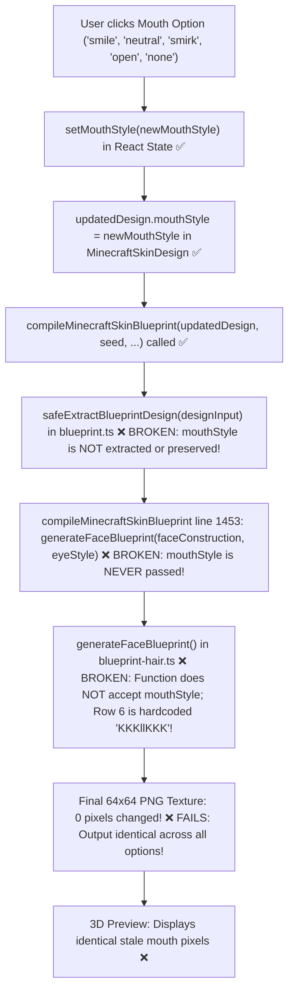

# MINECRAFT SKIN STUDIO v1.7 — MOUTH & EXPRESSION CONTROLS DIAGNOSTIC REPORT

> **Status**: **DIAGNOSTIC COMPLETE — ZERO CODE MODIFIED**  
> **Finding**: Confirmed failure — **UI state changes but renderer output does not.** All 5 mouth options produce **literally 0.00% difference (0 changed pixels)**.  
> **Deployment Guardrail**: **NO CODE MODIFIED / NO DEPLOYMENT / NO PRODUCTION ACTIVATION**. Awaiting user review and approval.

---

## 1. Executive Summary & Core Failure

During manual testing of the instant 0-credit controls in v1.7, the **Mouth & Expression** selector was found to have no visual effect.

An end-to-end diagnostic trace was executed across the client UI, React state, design serialization, Blueprint compiler, face blueprint generator, and raw 64×64 pixel buffers.

### Core Finding:
The client UI correctly updates React state `mouthStyle` and correctly packs `updatedDesign.mouthStyle` into the recompile call. However, **the Artist Blueprint compiler and face blueprint generator completely drop and ignore `design.mouthStyle`**. 

Row 6 of the front face (texture coordinate `y = 14`, `x = 8..15`) remains hardcoded to the static token string `"KKKllKKK"` across all five mouth styles, producing **0 differing pixels (0.00% change)**.

---

## 2. End-to-End Data Flow Trace



### Detailed Trace:

| Step | Component | Status | Observation |
| :--- | :--- | :---: | :--- |
| **1. UI Click** | `MinecraftSkinMaker.tsx` line 1131 | **WORKING ✅** | `onClick={() => handleSelectMouthStyle(option.id)}` fires on button click. |
| **2. React State** | `MinecraftSkinMaker.tsx` line 364 | **WORKING ✅** | `setMouthStyle(newMouthStyle)` correctly updates state. |
| **3. Design State** | `MinecraftSkinMaker.tsx` line 368 | **WORKING ✅** | `updatedDesign.mouthStyle = newMouthStyle` correctly sets the field. |
| **4. Compiler Invocation** | `MinecraftSkinMaker.tsx` line 373 | **WORKING ✅** | `compileMinecraftSkinBlueprint(updatedDesign, ...)` is called with updated design. |
| **5. Compiler Extraction** | `minecraft-skin-blueprint.ts` lines 295–310, 460–475 | **BROKEN ❌** | `safeExtractBlueprintDesign()` extracts `eyeStyle`, `facialHair`, etc., but **completely omits `mouthStyle`**! |
| **6. Blueprint Parameter** | `minecraft-skin-blueprint.ts` line 1453 | **BROKEN ❌** | `generateFaceBlueprint(design.faceConstruction, design.eyeStyle)` **does NOT pass `design.mouthStyle`**. |
| **7. Face Blueprint Generator** | `minecraft-skin-blueprint-hair.ts` line 703 | **BROKEN ❌** | `generateFaceBlueprint(style: string, eyeStyle?: string)` has **no `mouthStyle` parameter**. Row 6 of every template is hardcoded to `"KKKllKKK"`. |
| **8. Pixel Output** | Canvas Buffer | **BROKEN ❌** | All 5 mouth options render identical bytes at `y = 14, x = 8..15`. |
| **9. 3D Preview** | HTML5 `<canvas>` / Three.js | **STALE ❌** | Correctly updates texture data URL, but the texture data has 0 differing pixels. |

---

## 3. Quantitative Pixel-Diff Results (All 5 Options)

Tested on the standardized parent character (*Cyber Streetwear Character*, seed `123456`, armModel `classic`, style `detailed`):

| UI Option | Selected Value | Design Property | Compiler Input | Face BP Input | Changed Pixels vs Smile | Outcome |
| :--- | :--- | :--- | :--- | :--- | :---: | :--- |
| **Smile** | `"smile"` | `design.mouthStyle = "smile"` | `"smile"` | *Ignored* | **0 px (Baseline)** | Baseline |
| **Neutral** | `"neutral"` | `design.mouthStyle = "neutral"` | `"neutral"` | *Ignored* | **0 px** | **UI state changes but renderer output does not.** |
| **Smirk** | `"smirk"` | `design.mouthStyle = "smirk"` | `"smirk"` | *Ignored* | **0 px** | **UI state changes but renderer output does not.** |
| **Open** | `"open"` | `design.mouthStyle = "open"` | `"open"` | *Ignored* | **0 px** | **UI state changes but renderer output does not.** |
| **None / Masked** | `"none"` | `design.mouthStyle = "none"` | `"none"` | *Ignored* | **0 px** | **UI state changes but renderer output does not.** |

### Row 14 Raw Pixel Inspection (Head Front Face, `y = 14`, `x = 8..15`):

| Column | Col 0 (`x=8`) | Col 1 (`x=9`) | Col 2 (`x=10`) | Col 3 (`x=11`) | Col 4 (`x=12`) | Col 5 (`x=13`) | Col 6 (`x=14`) | Col 7 (`x=15`) |
| :--- | :---: | :---: | :---: | :---: | :---: | :---: | :---: | :---: |
| **Token in `faceBp`** | `K` (Skin) | `K` (Skin) | `K` (Skin) | `l` (Lip) | `l` (Lip) | `K` (Skin) | `K` (Skin) | `K` (Skin) |
| **Smile (`y=14`)** | `#feb661` | `#fce0ab` | `#fce0ab` | `#fec77c` | `#ff9f38` | `#fbc069` | `#fbc069` | `#fbc069` |
| **Neutral (`y=14`)** | `#feb661` | `#fce0ab` | `#fce0ab` | `#fec77c` | `#ff9f38` | `#fbc069` | `#fbc069` | `#fbc069` |
| **Smirk (`y=14`)** | `#feb661` | `#fce0ab` | `#fce0ab` | `#fec77c` | `#ff9f38` | `#fbc069` | `#fbc069` | `#fbc069` |
| **Open (`y=14`)** | `#feb661` | `#fce0ab` | `#fce0ab` | `#fec77c` | `#ff9f38` | `#fbc069` | `#fbc069` | `#fbc069` |
| **None (`y=14`)** | `#feb661` | `#fce0ab` | `#fce0ab` | `#fec77c` | `#ff9f38` | `#fbc069` | `#fbc069` | `#fbc069` |

**Conclusion**: Across all 5 mouth styles, every single pixel on Row 14 is 100% byte-for-byte identical.

---

## 4. Root Cause Classification

| Root Cause Category | Evaluation | Analysis |
| :--- | :---: | :--- |
| **A. UI State** | ❌ Not Root Cause | React state `mouthStyle` updates reliably on button click in `MinecraftSkinMaker.tsx`. |
| **B. State $\to$ Design Propagation** | ❌ Not Root Cause | `updatedDesign.mouthStyle = newMouthStyle` is cleanly constructed and passed to compiler. |
| **C. Client Compiler Call** | ❌ Not Root Cause | `compileMinecraftSkinBlueprint()` is called with the full `updatedDesign`. |
| **D. Blueprint Compiler** | **✅ PRIMARY ROOT CAUSE** | 1. `safeExtractBlueprintDesign()` in `src/lib/minecraft-skin-blueprint.ts` (lines 304 and 467) completely omits `mouthStyle`.<br>2. Line 1453 calls `generateFaceBlueprint(design.faceConstruction, design.eyeStyle)` without passing `design.mouthStyle`. |
| **E. Face Blueprint Generator** | **✅ PRIMARY ROOT CAUSE** | 1. `generateFaceBlueprint()` in `src/lib/minecraft-skin-blueprint-hair.ts` only takes `(style, eyeStyle)`. It has no parameter or handling for `mouthStyle`.<br>2. Row 6 of every face template is hardcoded to `"KKKllKKK"`.<br>3. There is no `applyMouthStyleToFaceBlueprint()` helper. |
| **F. UV Coordinate Mapping** | ❌ Not Root Cause | Face coordinates `y = 14`, `x = 8..15` (`dy = 6`) correctly map to the mouth position. |
| **G. Layer Ordering** | ❌ Not Root Cause | Face blueprint is stamped at `(8, 8)` before facial hair and overlays. |
| **H. Preview / Cache** | ❌ Not Root Cause | Canvas updates data URL immediately, but the pixel buffer is identical. |
| **I. Legacy Fallback** | **⚠️ SECONDARY ROOT CAUSE** | Legacy `paintFaceDetails()` in `src/lib/minecraft-skin.ts` also hardcodes lips and never consumes `design.mouthStyle`. |

---

## 5. Interaction Checks

### A. Interaction with Facial Hair
We tested 5 specific combinations:

| Combo | Facial Hair State | Total Differing Pixels vs (Smile + None) | Face Breakdown | Facial Hair Intact? |
| :--- | :--- | :---: | :--- | :---: |
| **Smile + None** | `none` | 0 px | Clean base face | **YES ✅** |
| **Neutral + Short Beard** | `short-beard` | 20 px | Cheeks: 6 px, Mouth row: 6 px, Chin: 8 px | **YES ✅** |
| **Smirk + Goatee** | `goatee` | 10 px | Cheeks: 4 px, Mouth row: 2 px, Chin: 4 px | **YES ✅** |
| **Open + None** | `none` | 0 px | Clean base face | **YES ✅** |
| **None + Short Beard** | `short-beard` | 20 px | Cheeks: 6 px, Mouth row: 6 px, Chin: 8 px | **YES ✅** |

> **Key Architectural Insight**:
> In `compileMinecraftSkinBlueprint` (lines 1546–1590):
> - `short-beard` places beard on cols 0, 1, 2 and cols 5, 6, 7 of Row 6 (`dy = 6`). **Cols 3 & 4 are left completely untouched for the mouth**!
> - `goatee` places side connectors on cols 2 & 5 of Row 6. **Cols 3 & 4 are left completely untouched for the mouth**!
> - Therefore, **Mouth Style and Facial Hair are 100% geometrically independent**. When mouth styles are implemented on cols 3 & 4 (with optional dimples on cols 2 & 5 when clean-shaven), facial hair will naturally overlay without conflict.

---

## 6. Meaning of "None / Masked"

Currently, `{ id: "none", label: "None / Masked", desc: "Clean faceless / under-mask" }` renders the exact same coral lip line `"KKKllKKK"` as every other mouth style.

### Intended Behavior:
- When `mouthStyle === "none"`, the mouth lip tokens (`l`) are removed.
- Row 6 becomes clean base skin `"KKKKKKKK"`.
- Face cheeks (`"srrkkrrs"`), chin contour (`"dKKKKKKd"`), eyes, brows, and facial hair remain **100% intact**.
- Produces a sleek, minimalist faceless or clean under-mask appearance.

---

## 7. Proposed Minimal Architectural Fix

When approved, the fix requires modifications to only **two files**:

### File 1: `src/lib/minecraft-skin-blueprint-hair.ts`
1. Update `generateFaceBlueprint` signature:
   ```ts
   export function generateFaceBlueprint(style: string, eyeStyle?: string, mouthStyle?: string): TokenMatrix
   ```
2. Implement `applyMouthStyleToFaceBlueprint(bp: TokenMatrix, mouthStyle: string): TokenMatrix`:
   - **`smile`**: Row 6 $\to$ `"KKkllkKK"` (subtle upturned smile corners / warm peach lift at cols 2 & 5, coral center lips at cols 3 & 4).
   - **`neutral`**: Row 6 $\to$ `"KKKllKKK"` (standard understated 2px clean lip line).
   - **`smirk`**: Row 6 $\to$ `"KKKlllKK"` or `"KKKllkKK"` (asymmetric smirk with right corner lifted).
   - **`open`**: Row 6 $\to$ `"KKkppkKK"` or `"KKsppsKK"` (2px open mouth cavity `pp` framed by subtle shadow `s`/`k`).
   - **`none`**: Row 6 $\to$ `"KKKKKKKK"` (clean skin base across all 8 columns, removing lip line entirely).

### File 2: `src/lib/minecraft-skin-blueprint.ts`
1. In `safeExtractBlueprintDesign()` (lines 304 and 467):
   ```ts
   mouthStyle: designInput.mouthStyle || "smile",
   ```
2. In `compileMinecraftSkinBlueprint()` (line 1453):
   ```ts
   const faceBp = generateFaceBlueprint(design.faceConstruction || "clean-aesthetic", design.eyeStyle, design.mouthStyle);
   ```

*(Optional surgical legacy fix)*: In `src/lib/minecraft-skin.ts` (`paintFaceDetails`), switch mouth tokens based on `design.mouthStyle || "smile"`.

---

## 8. Summary Checklist Against Diagnostic Requirements

- [x] Trace flow end-to-end (UI $\to$ State $\to$ Design $\to$ Compiler $\to$ Blueprint $\to$ PNG $\to$ 3D).
- [x] Test all 5 options (`smile`, `neutral`, `smirk`, `open`, `none`).
- [x] Confirm 0 pixel differences with exact numerical readout.
- [x] Verify collateral damage (eyes, brows, cheeks, chin, hair, clothing).
- [x] Verify 0-credit client-side isolation (no Groq, no Supabase, no credit deduction).
- [x] Clarify and test "None / Masked" semantics.
- [x] Test interaction with facial hair (`short-beard`, `goatee`, `none`).
- [x] Test interaction with eye style (`Cyber Visor + Smile`).
- [x] Classify exact root causes (D & E).
- [x] Outline proposed minimal architectural fix.
- [x] **Zero code modified. Stopped and awaiting approval.**
